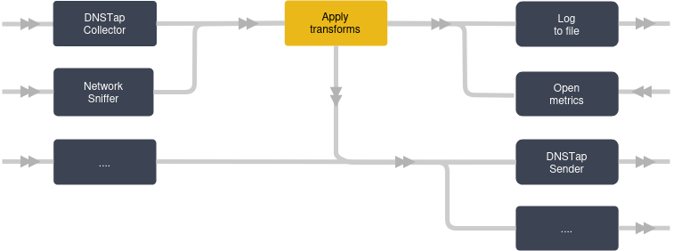
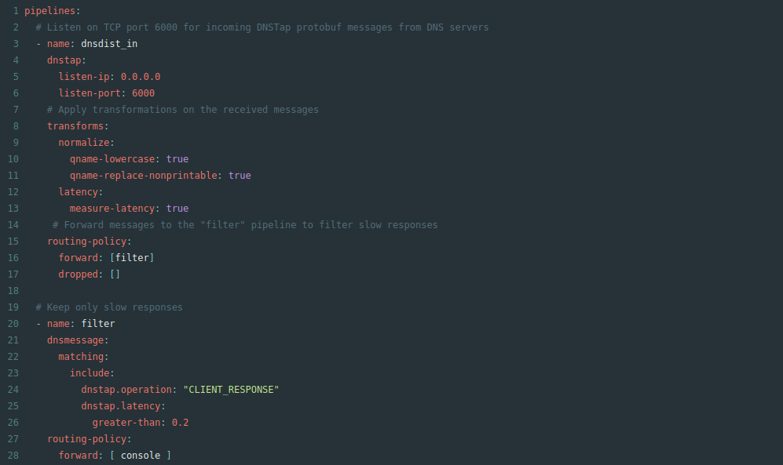
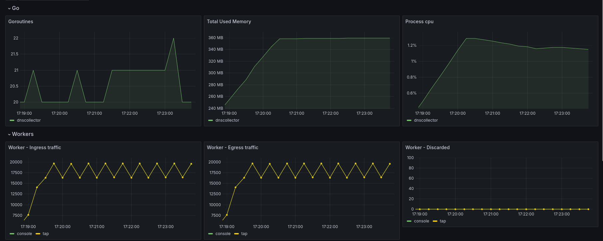

<p align="center">


</p>

<p align="center">

</p>

<p align="center">

</p>

`DNS-collector` acts as a passive high speed **ingestor** with **pipelining** support for your DNS logs, written in **Golang**. It allows enhancing your DNS logs by adding metadata, extracting usage patterns, and facilitating security analysis.

> Additionally, DNS-collector also support
>
> - [Extended](https://github.com/dmachard/go-dns-collector/blob/main/docs/extended_dnstap.md) DNStap with TLS encryption, compression, and more metadata capabilities
> - DNS protocol conversions (to [plain text](https://github.com/dmachard/go-dns-collector/blob/main/docs/configuration.md#custom-text-format), [JSON](https://github.com/dmachard/go-dns-collector/blob/main/docs/dnsjson.md), and more... )
> - DNS parser with [Extension Mechanisms for DNS (EDNS)](https://github.com/dmachard/go-dns-collector/blob/main/docs/dnsparser.md) support
> - IPv4/v6 defragmentation and TCP reassembly
> - Nanoseconds in timestamps

## Features

- **[Pipelining](./docs/running_mode.md)**

   The DNS traffic can be collected and aggregated from simultaneously [sources](./docs/workers.md) like DNStap streams, network interface or log files and relays it to multiple other [listeners](./docs/workers.md) 

  [](./docs/running_mode.md)

  You can also applied  [transformations](./docs/transformers.md) on it like ([traffic filtering](./docs/transformers.md#dns-filtering), [user privacy](./docs/transformers.md#user-privacy), ...).

  [](./docs/configuration.md)

- **[Collectors & Loggers](./docs/workers.md)**

  - *Listen for logging traffic with streaming network protocols*
    - [`DNStap`](docs/collectors/collector_dnstap.md#dns-tap) with `tls`|`tcp`|`unix` transports support and [`proxifier`](docs/collectors/collector_dnstap.md#dns-tap-proxifier)
    - [`PowerDNS`](docs/collectors/collector_powerdns.md) streams with full  support
    - [`DNSMessage`](docs/collectors/collector_dnsmessage.md) to route DNS messages based on specific dns fields
    - [`TZSP`](docs/collectors/collector_tzsp.md) protocol support
  - *Live capture on a network interface*
    - [`AF_PACKET`](docs/collectors/collector_afpacket.md) socket with BPF filter
    - [`eBPF XDP`](docs/collectors/collector_xdp.md) ingress traffic
  - *Read text or binary files as input*
    - Read and tail on [`Plain text`](docs/collectors/collector_tail.md) files
    - Ingest [`PCAP`](docs/collectors/collector_fileingestor.md) or [`DNSTap`](docs/collectors/collector_fileingestor.md) files by watching a directory
  - *Local storage of your DNS logs in text or binary formats*
    - [`Stdout`](docs/loggers/logger_stdout.md) console in text or binary output
    - [`File`](docs/loggers/logger_file.md) with automatic rotation and compression
  - *Provide metrics and API*
    - [`Prometheus`](docs/loggers/logger_prometheus.md) exporter
    - [`Statsd`](docs/loggers/logger_statsd.md) support
    - [`REST API`](docs/loggers/logger_restapi.md) with [swagger](https://generator.swagger.io/?url=https://raw.githubusercontent.com/dmachard/go-dnscollector/main/docs/swagger.yml) to search DNS domains
  - *Send to remote host with generic transport protocol*
    - Raw [`TCP`](docs/loggers/logger_tcp.md) client
    - [`Syslog`](docs/loggers/logger_syslog.md) with TLS support
    - [`DNSTap`](docs/loggers/logger_dnstap.md) protobuf client
  - *Send to various sinks*
    - [`Fluentd`](docs/loggers/logger_fluentd.md)
    - [`InfluxDB`](docs/loggers/logger_influxdb.md)
    - [`Loki`](docs/loggers/logger_loki.md) client
    - [`ElasticSearch`](docs/loggers/logger_elasticsearch.md)
    - [`Scalyr`](docs/loggers/logger_scalyr.md)
    - [`Redis`](docs/loggers/logger_redis.md) publisher
    - [`Kafka`](docs/loggers/logger_kafka.md) producer
    - [`ClickHouse`](docs/loggers/logger_clickhouse.md) client
  - *Send to security tools*
    - [`Falco`](docs/loggers/logger_falco.md)

- **[Transformers](./docs/transformers.md)**

  - [Rewrite](docs/transformers/transform_rewrite.md) DNS messages or custom [Relabeling](docs/transformers/transform_relabeling.md) for JSON output
  - Add additionnal [Tags](docs/transformers/transform_atags.md) in DNS messages
  - Traffic [Filtering](docs/transformers/transform_trafficfiltering.md) and [Reducer](docs/transformers/transform_trafficreducer.md)
  - Latency [Computing](docs/transformers/transform_latency.md)
  - Apply [User Privacy](docs/transformers/transform_userprivacy.md)
  - [Normalize](docs/transformers/transform_normalize.md) DNS messages
  - Add [Geographical](docs/transformers/transform_geoip.md) metadata
  - Various data [Extractor](docs/transformers/transform_dataextractor.md)
  - Suspicious traffic [Detector](docs/transformers/transform_suspiciousdetector.md) and [Prediction](docs/transformers/transform_trafficprediction.md)

## Get Started

Download the latest [`release`](https://github.com/dmachard/go-dns-collector/releases) binary and start the DNS-collector with the provided configuration file. The default configuration listens on `tcp/6000` for a DNSTap stream and DNS logs are printed on standard output.

```bash
./go-dnscollector -config config.yml
```


If you prefer run it from docker, follow this [guide](./docs/docker.md).

## Configuration

The configuration of DNS-collector is done through a file named [`config.yml`](config.yml). When the DNS-collector starts, it will look for the config.yml from the current working directory.

See the full [configuration guide](./docs/configuration.md) for more details.

Run the DNS-collector in dry mode to verify the configuration.

```bash
./go-dnscollector -config config.yml -test-config
INFO: 2023/12/24 14:43:29.043730 main - config OK!
```

## Usage examples

The [`_examples`](./docs/_examples) folder from documentation contains a number of [various configurations](./docs/examples.md) to get you started with the DNS-collector in different ways.

The [`_integration`](./docs/_integration) folder contains DNS-collector `configuration` files and `docker compose` examples for popular tools:

- [Fluentd](./docs/_integration/fluentd/README.md)
- [Elasticsearch](./docs/_integration/elasticsearch/README.md)
- [Kafka](./docs/_integration/kafka/README.md)
- [InfluxDB](./docs/_integration/influxdb/README.md)
- [Prometheus](./docs/_integration/prometheus/README.md)
- [Loki](./docs/_integration/loki/README.md)

## DNS Telemetry

`DNS-collector` provides telemetry capabilities with the Prometheus logger, 
you can easily monitor key performance indicators and detect anomalies in real-time.


## Performance

Tuning may be necessary to deal with a large traffic loads.
Please refer to the [performance tuning](./docs/performance.md) guide if needed.

Performance metrics are available to evaluate the efficiency of your pipelines. These metrics allow you to track:
- The number of incoming and outgoing packets processed by each worker
- The number of packets matching the policies applied (forwarded, dropped)
- The number of "discarded" packets
- Memory consumption
- CPU consumption

A [build-in](./docs/dashboards/grafana_exporter.json) dashboard is available for monitoring these metrics.



## Contributing

See the [development guide](./docs/development.md) for more information on how to build it yourself.
