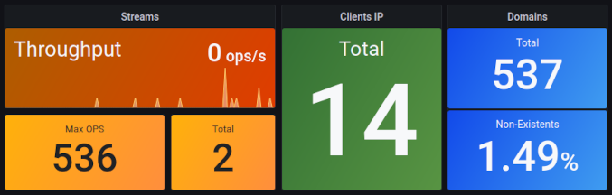

# DNS Collector


[](https://goreportcard.com/report/dmachard/go-dns-collector)

*NOTE: The code before version 1.x is considered beta quality and is subject to breaking changes.*

##  Overview

This tool acts as a high speed **aggregator, analyzer, transporter and logging**  for your DNS logs, written in **Golang**. 
The DNS Traffic can be collected and aggregated simultaneously from many different sources (dnstap, sniffer, logs, etc.) .


This tool can also help you to visualize DNS traffic errors and anomalies with Grafana dashboard.



This tool can be used to transform dns queries or replies in JSON format with EDNS support.
 
 ```js
{
  // query/reply ip and port, tcp/udp protocol and family used
  "network": {...},
  // message type, arrival packet time, latency.
  "dnstap": {...},
  // dns fields
  "dns": {...},
  // extended dns options like csubnet
  "edns": {...},
  // country, continent and city informations
  "geo": {...},
  // specific powerdns metadata like tags, original-request-subnet
  "pdns": {...}
}
```


## Features

- [Logs routing](doc/multiplexer.md)
- [Queries/Replies JSON encoding](doc/dnsjson.md)
- Collectors:
    - [DNStap streams](doc/collectors.md#dns-tap) 
    - [DNS packets sniffer](doc/collectors.md#dns-sniffer)
    - [Tail on log file](doc/collectors.md#tail)
    - [Protobuf PowerDNS](doc/collectors.md#protobuf-powerdns)
- Loggers:
    - [Console](doc/loggers.md#stdout)
    - [Prometheus](doc/loggers.md#prometheus)
    - [File](doc/loggers.md#log-file)
    - [DNStap](doc/loggers.md#dnstap-client)
    - [TCP](doc/loggers.md#tcp-client)
    - [REST API](doc/loggers.md#rest-api)
    - [Syslog](doc/loggers.md#syslog)
    - [Fluentd](doc/loggers.md#fluentd-client)
    - [Pcap](doc/loggers.md#pcap-file)
    - [InfluxDB](doc/loggers.md#influxdb-client)
    - [Loki](doc/loggers.md#loki-client)
    - [Statsd](doc/loggers.md#statsd-client)
    - [ElasticSearch](doc/loggers.md#elasticsearch-client)

- Other features
    - [DNS decoder with extended options support](doc/dnsparser.md)
    - [Built-in Grafana dashboards](doc/dashboards.md)
    - [GeoIP support](doc/configuration.md#geoip-support)
    - [Text format](doc/configuration.md#custom-text-format)
    - [DNS filtering](doc/configuration.md#dns-filtering)
    - [User Privacy](doc/configuration.md#user-privacy)
    - [Normalize Qname](doc/configuration.md#qname-lowercase)

## Installation

**Run-it from binary**

Download the binary from release page. If you want to integrate this tool with systemd, please to follow this [guide](https://dmachard.github.io/posts/0007-dnscollector-install-binary/).

```go
./go-dnscollector -config config.yml
```

**Run-it from dockerhub**

Use the default config (dnstap -> stdout + rest api):

```bash
docker run -d --name=dnscollector01 dmachard/go-dnscollector
```

Override the default configuration (/etc/dnscollector/config.yml) with a config file on the host:

```bash
-v $(pwd)/config.yml:/etc/dnscollector/config.yml
```

## Configuration

See the full [Configuration guide](doc/configuration.md) for more details.

## Use-cases

As prerequisites, we assume you have a DNS server which supports DNSTap (unbound, bind, powerdns, etc)

For more informations about **dnstap**, please to read the following page [Dnstap: How to enable it on main dns servers](https://dmachard.github.io/posts/0001-dnstap-testing/)

- [x] [Use case 1: Capture dns traffic (dnstap) and backup-it to text log files](https://dmachard.github.io/posts/0034-dnscollector-dnstap-to-log-files/)
- [x] [Use case 2: Capture dns traffic (dnstap) and get statistics usage with Prometheus + Grafana](https://dmachard.github.io/posts/0035-dnscollector-grafana-prometheus/)
- [x] [Use case 3: Convert captured dns traffic (dnstap) to JSON format](https://dmachard.github.io/posts/0042-dnscollector-dnstap-json-answers/)
- [x] [Use case 4: Capture dns traffic (dnstap) and follow dns logs with Loki + Grafana](https://dmachard.github.io/posts/0044-dnscollector-grafana-loki/)
- [x] [Use case 5: Forward unix dnstap socket traffic to TLS dnstap stream](example-config/use-case-5.yml)
- [x] [Use case 6: Capture dns traffic with user privacy options enabled](example-config/use-case-6.yml)
- [x] [Use case 7: Running multiple dnstap collectors in parallel and aggregate logs in the same file](example-config/use-case-7.yml)
- [x] [Use case 8: Multiple PowerDNS collectors in parallel with prometheus metrics](example-config/use-case-8.yml)

## Benchmark

Tested on the following machine: 8 vCPUs, 32 GB memory

| packet per sec received| DnsCollector |
| ---- | ---- | 
| 50k   | OK - 0% lost| 
| 100k   | OK - 0% lost| 
| 150k   | OK (0.07% lost)|

## For developers

Run from source 

```
go run .
```

Execute testunits

```
go test -timeout 10s ./collectors/ -cover -v
go test -timeout 10s ./loggers/ -cover -v
go test -timeout 10s ./transformers/ -cover -v
go test -timeout 10s ./dnsutils/ -cover -v
```

Execute a test for one specific testcase in a package

```
go test -timeout 10s -cover -v ./loggers -run TestSyslogRunJsonMode
```

Building from source. Use the latest golang available on your target system 

```
CGO_ENABLED=0 GOOS=linux GOARCH=amd64 go build -o go-dnscollector *.go
```

Update package dependencies

```
go get github.com/dmachard/go-logger@v0.2.0
go get github.com/dmachard/go-powerdns-protobuf@v0.0.3
go get github.com/dmachard/go-dnstap-protobuf@v0.2.0
go mod tidy
```
