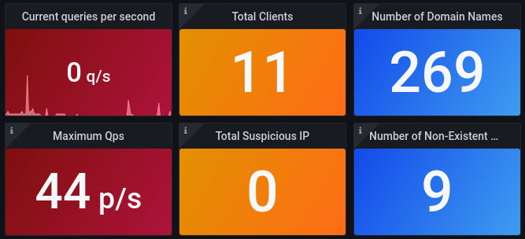

# DNS Collector

##  Overview

This `dns collector` acts as a high speed passive analyser for DNS traffic written in Go.
It supports several methods as input to collect dns traffic or logs and can redirect them to multiple destinations.



## Features


- Supported dns traffic collectors:
    - **[Dnstap](https://dnstap.info/) Streams**
        * tcp or unix socket listener
        * tls support
    - **DNS packets sniffer**
        * IPv4, IPv6 support (fragmented packet ignored)
        * UDP and TCP transport
        * BFP filtering
    - **Tail**
        * Read DNS events from the tail of text files
        * Regex support

- Supported loggers:
    - **Stdout**: logs your dns queries and replies to stdout
        * supported format: text, json
        * custom text format
    - **Text files**: logs your dns queries and replies to text files
        * with rotation file support
        * supported format: text, json
        * gzip compression
        * execute external command after each rotation
        * custom text format
    - **[Dnstap](https://dnstap.info/) stream client**
        * to remote tcp destination or unix socket
        * tls support
    - **Raw TCP**
        * to remote tcp destination or unix socket
        * supported format: text, json
        * custom text format
        * tls support
    - **[Rest API](https://generator.swagger.io/?url=https://raw.githubusercontent.com/dmachard/go-dnscollector/main/doc/swagger.yml)**
        * prometheus metrics format
        * qps, total queries/replies, top domains, clients, rcodes...
        * basic auth
        * tls support
    - **[Syslog](https://en.wikipedia.org/wiki/Syslog)**
        * local or remote server
        * custom text format
        * supported format: text, json
        * tls support
    - **[Fluentd](https://www.fluentd.org/)**
        * to remote fluentd collector or unix socket
        * [msgpask](https://msgpack.org/)
        * tls support
    - **[Pcap](https://en.wikipedia.org/wiki/Pcap)**
        * with rotation file support
        * binary format
        * gzip compression
        * execute external command after each rotation
    - **[InfluxDB](https://www.influxdata.com/)**
        * beta support
    - **[Loki](https://grafana.com/oss/loki/)**
        * beta support

- Other features
    - GeoIP support (Country code)
    - Packet filtering (regex support)
    - Query IP-Addresses anonymizer

## Installation

**Run-it from binary**

Download the binary from release page.
If you want to integrate this tool with systemd, please to follow this [guide](https://dmachard.github.io/posts/0007-dnscollector-install-binary/).

```go
./go-dnscollector -config config.yml
```

**Run-it from dockerhub**

Use the default config (dnstap -> stdout + rest api):

```bash
docker run -d --rm --network host --name=dnscollector01 dmachard/go-dnscollector
```

Override the default configuration (/etc/dnscollector/config.yml) with a config file on the host and custom ports:

```bash
docker run -d -p 6000:6000 -p 8080:8080 -v $(pwd)/config.yml:/etc/dnscollector/config.yml --name=dnscollector01 dmachard/go-dnscollector
```

## Configuration

A typically configuration would have one or more collector to receive DNS traffic or logs, and severals loggers to process the 
incoming traffics. See [Configuration guide](doc/configuration.md).

## Use-cases

As prerequisites, we assume you have a DNS server which supports DNSTap (unbound, bind, powerdns, etc)

- [x] [Use case 1: collect dnstap stream and backup-it to text log files](https://dmachard.github.io/posts/0034-dnscollector-dnstap-to-log-files/)
- [x] [Use case 2: collect dnstap stream and get statistics usage with Prometheus + Grafana](https://dmachard.github.io/posts/0035-dnscollector-grafana-prometheus/)
- [x] [Use case 3: collect dnstap stream and log dns answers in JSON format](https://dmachard.github.io/posts/0042-dnscollector-dnstap-json-answers/)
- [x] [Use case 4: collect dnstap stream and follow dns logs with Loki + Grafana](https://dmachard.github.io/posts/0044-dnscollector-grafana-loki/)

For more informations about **dnstap**, please to read the following page [Dnstap: How to enable it on main dns servers](https://dmachard.github.io/posts/0001-dnstap-testing/)


## Metrics

See [Metrics](doc/metrics.txt).

| Metric | Description |
| ---- | ---- | 
| dnscollector_qps   | Number of queries per second received | 
| dnscollector_requesters_total | Number of clients |
| dnscollector_domains_total | Number of domains observed |
| dnscollector_received_bytes_total | Total bytes received |
| dnscollector_sent_bytes_total | Total bytes sent |

## Benchmark

Tested on the following machine: 8 vCPUs, 32 GB memory

| packet per sec received| DnsCollector |
| ---- | ---- | 
| 50k   | OK - 0% lost| 
| 100k   | OK - 0% lost| 
| 150k   | OK (0.07% lost)|

## For developers

Run from source 

```
go run .
```

Execute testunits for collectors

```
go test -timeout 10s ./collectors/ -cover -v
```

Execute testunits for loggers

```
go test -timeout 10s ./loggers/ -cover -v
```

Execute testunits for subprocessors

```
go test -timeout 10s ./subprocessors/ -cover -v
```

Execute a test for one specific testcase in a package

```
go test -timeout 10s -cover -v ./loggers -run TestSyslogRunJsonMode
```

Building from source.
Use the latest golang available on your target system 
```
CGO_ENABLED=0 GOOS=linux GOARCH=amd64 go build -o go-dnscollector *.go
```
