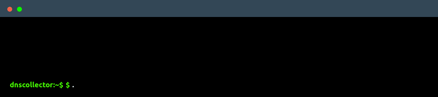

# DNS-collector

[](https://goreportcard.com/report/dmachard/go-dns-collector)


*NOTE: The code before version 1.x is considered beta quality and is subject to breaking changes.*

`DNS-collector` acts as a passive high speed **Ingestor, aggregator and distributor** for your DNS logs with usage indicators and security analysis, written in **Golang**. The DNS traffic can be collected and aggregated from simultaneously [sources](doc/collectors.md) like DNStap streams, network interface or log files and relays it to multiple other [listeners](doc/loggers.md) with some [transformations](doc/transformers.md) on it ([traffic filtering](doc/transformers.md#dns-filtering), [user privacy](doc/transformers.md#user-privacy), ...).

> Additionally, DNS-collector also support
>
> - DNS protocol conversions (to [plain text](doc/configuration.md#custom-text-format), [JSON](doc/dnsjson.md), and more... )
> - [Extension Mechanisms for DNS (EDNS)](doc/dnsparser.md) decoding
> - IPv4/v6 defragmentation and TCP reassembly
> - Nanoseconds in timestamps

**Overview**:

<p align="center">

</p>


## Features

**[Collectors](doc/collectors.md)**:

- *Listen for logging traffic with streaming network protocols*
  - [`DNStap`](doc/collectors/collector_dnstap.md#dns-tap_) with `tls`|`tcp`|`unix` transports support and [`proxifier`](doc/collectors/collector_dnstap.md#dns-tap-proxifier)
  - [`PowerDNS`](doc/collectors/collector_powerdns.md_) streams with full  support
  - [`TZSP`](doc/collectors/collector_tzsp.md) protocol support
- *Live capture on a network interface*
  - [`AF_PACKET`](doc/collectors/collector_afpacket.md) socket with BPF filter
  - [`eBPF XDP`](doc/collectors/collector_xdp.md) ingress traffic
- *Read text or binary files as input*
  - Read and tail on [`Plain text`](doc/collectors/collector_tail.md) files
  - Ingest [`PCAP`](doc/collectors/collector_fileingestor.md) or [`DNSTap`](doc/collectors/collector_fileingestor.md) files by watching a directory

**[Loggers](doc/loggers.md)**:

- *Local storage of your DNS logs in text or binary formats*
  - [`Stdout`](doc/loggers/logger_stdout.md) console in text or binary output
  - [`File`](doc/loggers/logger_file.md) with automatic rotation and compression
- *Provide metrics and API*
  - [`Prometheus`](doc/loggers/logger_prometheus.md) metrics and visualize-it with built-in Grafana dashboard
  - [`Statsd`](doc/loggers/logger_statsd.md) support
  - [`REST API`](doc/loggers/logger_restapi.md) with [swagger](https://generator.swagger.io/?url=https://raw.githubusercontent.com/dmachard/go-dnscollector/main/doc/swagger.yml) to search DNS domains
- *Send to remote host with generic transport protocol*
  - [`TCP`](doc/loggers/logger_tcp.md)
  - [`Syslog`](doc/loggers/logger_syslog.md)
  - [`DNSTap`](doc/loggers/logger_dnstap.md) protobuf messages
- *Send to various sinks*
  - [`Fluentd`](doc/loggers/logger_fluentd.md)
  - [`InfluxDB`](doc/loggers/logger_influxdb.md)
  - [`Loki`](doc/loggers/logger_loki.md) and visualize-it with built-in Grafana dashboard
  - [`ElasticSearch`](doc/loggers/logger_elasticsearch.md)
  - [`Scalyr`](doc/loggers/logger_scalyr.md)
  - [`Redis`](doc/loggers/logger_redis.md)
  - [`Kafka`](doc/loggers/logger_kafka.md)
- *Send to security tools*
  - [`Falco`](doc/loggers/logger_falco.md)

**Apply additionnal [transforms](doc/transformers.md) on traffic**:

- [Traffic Prediction](doc/transformers/transform_trafficprediction.md)
- [Traffic Reducer](doc/transformers/transform_trafficreducer.md)
- [Data Extractor](doc/transformers/transforme_dataextractor.md)
- [Latency Computing](doc/transformers/transform_latency.md)
- [Traffic filtering](doc/transformers/transform_trafficfiltering.md)
- [User Privacy](doc/transformers/transform_userprivacy.md)
- [Normalize](doc/transformers/transform_normalize.md)
- [Geographical metadata](doc/transformers/transform_geoip.md)
- [Suspicious traffic detector](doc/transformers/transform_suspicious.md)

## Get Started

Download the latest [`release`](https://github.com/dmachard/go-dns-collector/releases) binary and start the DNS-collector with the provided configuration file. The default configuration listens on `tcp/6000` for a DNSTap stream and DNS logs are printed on standard output.

```go
./go-dnscollector -config config.yml
```

If you prefer run it from docker, follow this [guide](doc/docker.md).

## Configuration

The configuration of DNS-collector is done through a file named [`config.yml`](config.yml). When the DNS-collector starts, it will look for the config.yml from the current working directory.

See the full [configuration guide](doc/configuration.md) for more details.

## Usage examples

The [`_examples`](./doc/_examples) folder from documentation contains a number of [various configurations](./doc/examples.md) to get you started with the `DNS-collector` in differentes ways.

## Contributing

See the [development guide](./doc/development.md) for more information on how to build it yourself.
