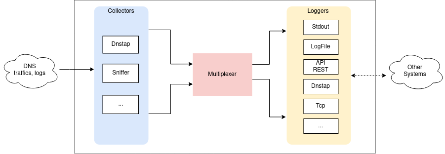

# DNS-collector

[](https://goreportcard.com/report/dmachard/go-dns-collector)


*NOTE: The code before version 1.x is considered beta quality and is subject to breaking changes.*

`DNS-collector` acts as a passive high speed **ingestor, aggregator and analyzer** for your DNS traffic, written in **Golang**. The DNS traffic can be collected and aggregated from simultaneously [sources](doc/collectors.md) like DNStap streams, network interface or log files and relays it to multiple other [listeners](doc/loggers.md) with some [transformations](doc/transformers.md) on it ([traffic filtering](doc/transformers.md#dns-filtering), [user privacy](doc/transformers.md#user-privacy), ...) and DNS protocol conversions (to [plain text](doc/configuration.md#custom-text-format), [json](doc/dnsjson.md), and more... ).

Additionally, DNS-collector also support 
- [Extension Mechanisms for DNS (EDNS)](doc/dnsparser.md) decoding
- IPv4/v6 defragmentation and TCP reassembly
- Nanoseconds in timestamps

**Overview**:



**Collectors**:
- *Listen for logging traffic with streaming network protocols*
    - [`DNStap`](doc/collectors.md#dns-tap) with `tls`|`tcp`|`unix` transports support and [`proxifier`](doc/collectors.md#dns-tap-proxifier)
    - [`PowerDNS`](doc/collectors.md#protobuf-powerdns) streams with [`full`](doc/powerdns.md)  support
    - [`TZSP`](doc/collectors.md#tzsp) protocol support
- *Live capture on a network interface*
    - [`AF_PACKET`](doc/collectors.md#live-capture-with-af_packet) socket with BPF filter
    - [`eBPF XDP`](doc/collectors.md#live-capture-with-ebpf-xdp) ingress traffic
- *Read text or binary files as input*
    - Read and tail on [`Plain text`](doc/collectors.md#tail) files
    - Ingest [`PCAP`](doc/collectors.md#file-ingestor) or [`DNSTap`](doc/collectors.md#file-ingestor) files by watching a directory

**Loggers**:

- *Local storage of your DNS logs in plain [`Text`](doc/configuration.md#custom-text-format),  [`Json`](doc/dnsjson.md), [`Pcap`](doc/loggers.md#log-file) or [`Dnstap`](doc/loggers.md#log-file) formats:*
    - [`Stdout`](doc/loggers.md#stdout) console with custom [directives](doc/configuration.md#custom-text-format)
    - [`File`](doc/loggers.md#log-file) with automatic rotation and compression
- *Provide metrics and API*
    - [`Prometheus`](doc/loggers.md#prometheus) metrics and visualize-it with built-in [dashboards](doc/dashboards.md) for Grafana
    - [`Statsd`](doc/loggers.md#statsd-client) support
    - [`REST API`](doc/loggers.md#rest-api) with [swagger](https://generator.swagger.io/?url=https://raw.githubusercontent.com/dmachard/go-dnscollector/main/doc/swagger.yml) to search DNS domains
- *Send to remote host with generic transport protocol*
    - [`TCP`](doc/loggers.md#tcp-client)
    - [`Syslog`](doc/loggers.md#syslog)
    - [`DNSTap`](doc/loggers.md#dnstap-client) protobuf messages
- *Send to various sinks*
    - [`Fluentd`](doc/loggers.md#fluentd-client)
    - [`InfluxDB`](doc/loggers.md#influxdb-client)
    - [`Loki`](doc/loggers.md#loki-client)
    - [`ElasticSearch`](doc/loggers.md#elasticsearch-client)
    - [`Scalyr`](doc/loggers.md#scalyr-client)
    - [`Redis`](doc/loggers.md#redispub)

**Transformers**:

- [`Traffic Reducer`](doc/transformers.md#traffic-reducer)
    - Detect repetitive queries/replies and log once
- [`Extractor`](doc/transformers.md#extract)
    - Add base64 encoded dns payload
- [`Latency Computing`](doc/transformers.md#latency-computing)
    - Compute latency between replies and queries
    - Detect and count unanswered queries
- [`Traffic filtering`](doc/transformers.md#traffic-filtering)
    - Downsampling
    - Dropping per Qname, QueryIP or Rcode
- [`User Privacy`](doc/transformers.md#user-privacy)
    - Anonymize QueryIP
    - Minimaze Qname
    - Hash Query and Response IP with SHA1
- [`Normalize`](doc/transformers.md#normalize)
    - Quiet Text
    - Qname to lowercase
    - Add TLD and TLD+1
- [`Geographical metadata`](doc/transformers.md#geoip-support)
    - Country and City
- [`Suspicious traffic detector`](doc/transformers.md#suspicious)
    - Malformed and large packet
    - Uncommon Qtypes used
    - Unallowed chars in Qname
    - Excessive number of labels
    - Long Qname

## Get Started

Download the latest [`release`](https://github.com/dmachard/go-dns-collector/releases) binary and start the DNS-collector with the provided configuration file. The default configuration listens on `tcp/6000` for a DNSTap stream and DNS logs are printed on standard output.

```go
./go-dnscollector -config config.yml
```

If you prefer run it from docker, follow this [guide](doc/docker.md).

## Configuration

The configuration of DNS-collector is done through a file named [`config.yml`](config.yml). When the DNS-collector starts, it will look for the config.yml from the current working directory. 

See the full [configuration guide](doc/configuration.md) for more details.

## Examples:

You will find below some examples of configuration to manage your DNS logs.

- Capture DNS traffic from incoming DNSTap streams
    - [x] [Read from UNIX DNSTap socket and forward it to TLS stream](example-config/use-case-5.yml)
    - [x] [Transform DNSTap as input to JSON format as output](example-config/use-case-3.yml)
    - [x] [Relays DNSTap stream to multiple remote destination without decoding](example-config/use-case-12.yml)
    - [x] [Aggregate several DNSTap stream and forward it to the same file](example-config/use-case-7.yml)

- Capture DNS traffic from PowerDNS products
    - [x] [Capture multiple PowerDNS streams](example-config/use-case-8.yml)

- Observe your DNS traffic from logs
    - [x] [Observe DNS metrics with Prometheus and Grafana](example-config/use-case-2.yml)
    - [x] [Follow DNS traffic with Loki and Grafana](example-config/use-case-4.yml)

- Apply some transformations
    - [x] [Capture DNSTap stream and apply user privacy on it](example-config/use-case-6.yml)
    - [x] [Filtering incoming traffic with downsample and whitelist of domains](example-config/use-case-9.yml)
    - [x] [Transform all domains to lowercase](example-config/use-case-10.yml)
    - [x] [Add geographical metadata with GeoIP](example-config/use-case-11.yml)
    - [x] [Count the number of outgoing queries without replies](example-config/use-case-18.yml)

- Capture DNS traffic from FRSTRM/dnstap files
    - [x] [Save incoming DNStap streams to file (frstrm)](example-config/use-case-13.yml)
    - [x] [Watch for DNStap files as input](example-config/use-case-14.yml)

- Capture DNS traffic from PCAP files
    - [x] [Capture DNSTap stream and backup-it to text and pcap files](example-config/use-case-1.yml)
    - [x] [Watch for PCAP files as input and JSON as output](example-config/use-case-15.yml)
    
- Capture DNS traffic from Mikrotik device
    - [x] [Capture TZSP packets containing DNS packets and process them as json](example-config/use-case-17.yml)

## Contributing

See the [development guide](doc/development.md) for more information on how to build it yourself.

How to userguides:
 - [Add a new collector](doc/development.md#add-collector)
 - [Add a new logger](doc/development.md#add-logger)
 - [Add a new transform](doc/development.md#add-transformer)