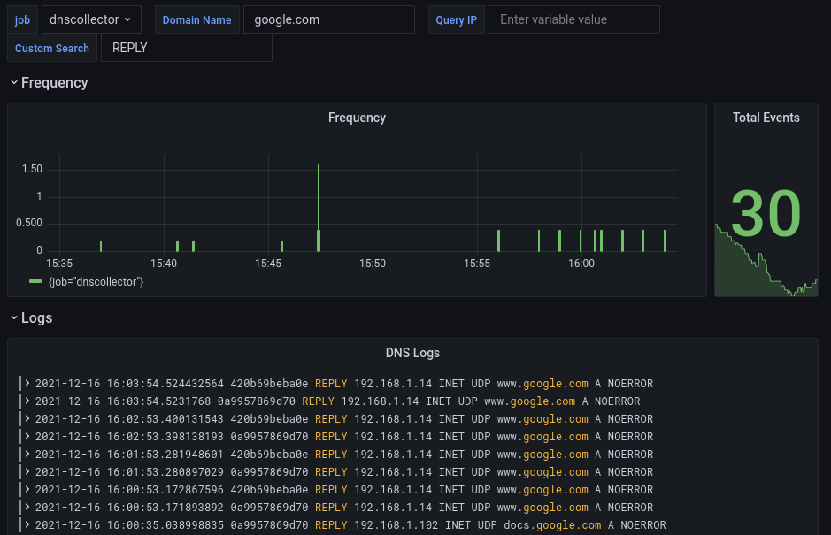

# Logger: Loki client

Loki client to remote server

Options:

- `server-url`: (string) Loki server url
- `job-name`: (string) Job name
- `mode`: (string) output format: `text`, `json`, or `flat-json`
- `flush-interval`: (integer) flush batch every X seconds
- `batch-size`: (integer) batch size for log entries in bytes
- `retry-interval`: (integer) interval in second between before to retry to send batch
- `text-format`: (string) output text format, please refer to the default text format to see all available [directives](../configuration.md#custom-text-format), use this parameter if you want a specific format
- `proxy-url`: (string) Proxy URL
- `tls-insecure` (boolean)
  > If set to true, skip verification of server certificate.
- `tls-min-version` (string)
  > Specifies the minimum TLS version that the server will support.
- `ca-file` (string)
  > Specifies the path to the CA (Certificate Authority) file used to verify the server's certificate.
- `cert-file` (string)
  > Specifies the path to the certificate file to be used. This is a required parameter if TLS support is enabled.
- `key-file` (string)
  > Specifies the path to the key file corresponding to the certificate file. This is a required parameter if TLS support is enabled.
- `chan-buffer-size` (int)
  > Specifies the maximum number of packets that can be buffered before dropping additional packets.
- `basic-auth-login`: (string) basic auth login
- `basic-auth-pwd`: (string) basic auth password
- `basic-auth-pwd-file`: (string) path to a file containing the basic auth password
- `tenant-id`: (string) tenant/organisation id. If omitted or empty, no X-Scope-OrgID header is sent.
- `relabel-configs`: (list) configuration to relabel targets. Functionality like described in <https://grafana.com/docs/loki/latest/clients/promtail/configuration/#relabel_configs>.

Default values:

```yaml
lokiclient:
  server-url: "http://localhost:3100/loki/api/v1/push"
  job-name: "dnscollector"
  mode: "text"
  flush-interval: 5
  batch-size: 1048576
  retry-interval: 10
  text-format: ""
  proxy-url: ""
  tls-insecure: false
  tls-min-version: 1.2
  ca-file: ""
  cert-file: ""
  key-file: ""
  basic-auth-login: ""
  basic-auth-pwd: ""
  basic-auth-pwd-file: ""
  tenant-id: ""
  relabel-configs: []
  chan-buffer-size: 65535
```

## Grafana dashboard with Loki datasource

The following [build-in](https://grafana.com/grafana/dashboards/15415) dashboard is available

<p align="center">
  
</p>
