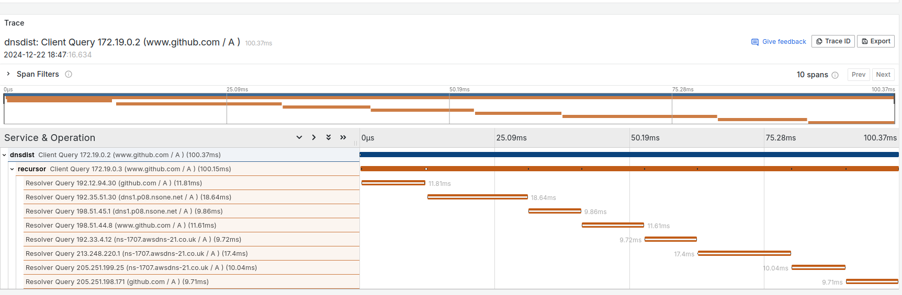
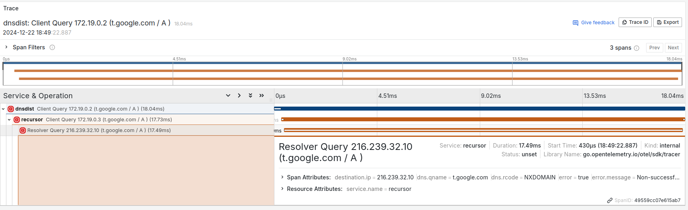

# Logger: OpenTelemetry

OpenTelemetry plugin Logger

**Experimental**: This feature is experimental and currently works only with the DNSDist and Recursor products from PowerDNS.

Options:
* `otel-endpoint` (string)
  > Specifies the endpoint for sending telemetry data to an OpenTelemetry collector. 
  > The endpoint should be specified in the format `host:port`.

Default values:

```yaml
opentelemetry:
  otel-endpoint: ""
```

Exemple of result with Tempo from Grafana

<p align="center">
  
</p>

Exemple with DNS error (NXDOMAIN)

<p align="center">
  
</p>
