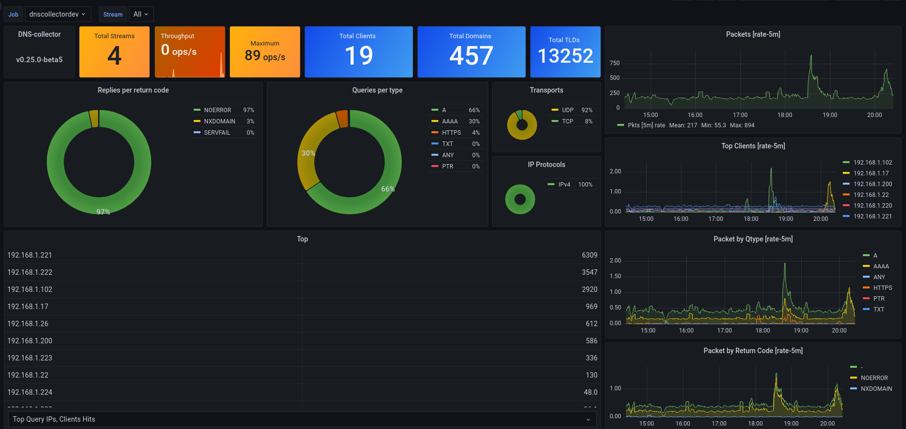

# Logger: Prometheus

This logger generates **prometheus** metrics. Use the following Grafana [dashboard](https://grafana.com/grafana/dashboards/16630).

Options:

- `listen-ip` (string)
  > listening IP

- `listen-port` (integer)
  > listening port

- `basic-auth-enable` (bool)
  > whether to enable basic auth

- `basic-auth-login` (string)
  > default login for basic auth

- `basic-auth-pwd` (string)
  > default password for basic auth

- `tls-support` (boolean)
  > tls support

- `tls-mutual` (boolean)
  > mtls authentication

- `tls-min-version` (string)
  > min tls version, default to 1.2

- `cert-file` (string)
  > certificate server file

- `key-file` (string)
  > private key server file

- `prometheus-suffix` (string)
  > prometheus suffix

- `top-n` (string)
  > default number of items on top

- `chan-buffer-size` (integer)
  > channel buffer size used on incoming dns message, number of messages before to drop it

- `histogram-metrics-enabled` (boolean)
  > compute histogram for qnames length, latencies, queries and replies size repartition

- `prometheus-labels` (list of strings)
  > labels to add to metrics. Currently supported labels: `stream_id` (default), `stream_global`, `resolver`
  
- `requesters-cache-size` (integer)
  > LRU (least-recently-used) cache size for observed clients DNS per stream

- `requesters-cache-ttl` (integer)
  > maximum time (in seconds) before eviction from the LRU cache

- `domains-cache-size` (integer)
  > LRU (least-recently-used) cache size for observed domains per strea

- `domains-cache-ttl` (integer)
  > maximum time (in seconds) before eviction from the LRU cache

- `noerror-domains-cache-size`: (integer)
  > LRU (least-recently-used) cache size for observed NOERROR domains per strea

- `noerror-domains-cache-ttl` (integer)
  > maximum time (in seconds) before eviction from the LRU cach

- `servfail-domains-cache-size` (integer)
  > LRU (least-recently-used) cache size for observed SERVFAIL domains per stream

- `servfail-domains-cache-ttl` (integer)
  > maximum time (in seconds) before eviction from the LRU cache

- `nonexistent-domains-cache-size`: (integer)
  > LRU (least-recently-used) cache size for observed NX domains per stream

- `nonexistent-domains-cache-ttl` (integer)
  > maximum time (in seconds) before eviction from the LRU cache

Default values:

```yaml
prometheus:
  listen-ip: 0.0.0.0
  listen-port: 8081
  basic-auth-enable: true
  basic-auth-login: admin
  basic-auth-pwd: changeme
  tls-support: false
  tls-mutual: false
  tls-min-version: 1.2
  cert-file: ""
  key-file: ""
  prometheus-prefix: "dnscollector"
  top-n: 10
  chan-buffer-size: 65535
  histogram-metrics-enabled: false
  requesters-metrics-enabled: true
  domains-metrics-enabled: true
  noerror-domains-metrics-enabled: true
  servfail-domains-metrics-enabled: true
  nonexistent-domains-metrics-enabled: true
  timeout-domains-metrics-enabled: true
  prometheus-labels: ["stream_id"]
  requesters-cache-size: 250000
  requesters-cache-ttl: 3600
  domains-cache-size: 500000
  domains-cache-ttl: 3600
  noerror-domains-cache-size: 100000
  noerror-domains-cache-ttl: 3600
  servfail-domains-cache-size: 10000
  servfail-domains-cache-ttl: 3600
  nonexistent-domains-cache-size: 10000
  nonexistent-domains-cache-ttl: 3600
  default-domains-cache-size: 1000
  default-domains-cache-ttl: 3600
```

Scrape metric with curl:

```bash
curl -u admin:changeme http://127.0.0.1:8080/metrics
```

## Metrics

The full metrics can be found [here](./../metrics.txt).

| Metric                                          | Notes
|-------------------------------------------------|------------------------------------
| dnscollector_build_info                         | Build info
| dnscollector_total_requesters_lru               | Total number of DNS clients most recently observed per stream identity.
| dnscollector_total_domains_lru                | Total number of serverfail domains most recently observed per stream identity
| dnscollector_total_noerror_domains_lru                | Total number of serverfail domains most recently observed per stream identity
| dnscollector_total_servfail_domains_lru                | Total number of serverfail domains most recently observed per stream identity
| dnscollector_total_nonexistentçdomains_lru                | Total number of NX domains most recently observed per stream identity
| dnscollector_dnsmessage_total                   | Counter of total of DNS messages
| dnscollector_queries_total                      | Counter of total of queries
| dnscollector_replies_total                      | Counter of total of replies
| dnscollector_qtypes_total                       | Counter of total of queries per qtypes
| dnscollector_dnsmessage_total                   | Counter of total of DNS messages
| dnscollector_ipprotocol_total                   | The total number of DNS messages per IP protocol (UDP, TCPs)
| dnscollector_ipversion_total                    | The total number of DNS messages per IP version (v4, v6)
| dnscollector_bytes_total                        | The total bytes sent and received
| dnscollector_sent_bytes_total                   | The total bytes sent
| dnscollector_received_bytes_total               | The total bytes received
| dnscollector_flag_tc_total                      | Total of DNS messages with TC flag
| dnscollector_flag_aa_total                      | Total of DNS messages with AA flag
| dnscollector_flag_ra_total                      | Total of DNS messages with RA flag
| dnscollector_flag_ad_total                      | Total of DNS messages with AD flag
| dnscollector_malformed_total                    | Total of malformed DNS messages
| dnscollector_fragmented_total                   | Total of fragmented DNS messages (IP level)
| dnscollector_reassembled_total                  | Total of reassembled DNS messages (TCP level)
| dnscollector_throughput_ops                     | Number of ops per second received, partitioned by stream
| dnscollector_throughput_ops_max                 | Max number of ops per second observed, partitioned by stream
| dnscollector_total_tlds_lru                     | Total number of tld most recently observed per stream identity
| dnscollector_top_domains                        | Number of hit per domain topN, partitioned by stream and qname
| dnscollector_top_nxdomains                      | Number of hit per nx domain topN, partitioned by stream and qname
| dnscollector_top_sfdomains                      | Number of hit per servfail domain topN, partitioned by stream and qname
| dnscollector_top_requesters                     | Number of hit per requester topN, partitioned by client IP
| dnscollector_top_tlds                           | Number of hit per tld - topN
| dnscollector_top_unanswered                     | Number of hit per unanswered domain - topN
| dnscollector_total_unanswered_lru               | Total number of unanswered domains most recently observed per stream identity
| dnscollector_total_suspicious_lru               | Total number of suspicious domains most recently observed per stream identity
| dnscollector_qnames_size_bytes_bucket           | Histogram of the size of the qname in bytes
| dnscollector_queries_size_bytes_bucket          | Histogram of the size of the queries in bytes.
| dnscollector_replies_size_bytes_bucket          | Histogram of the size of the replies in bytes.

## Grafana dashboard with prometheus datasource

The following [build-in](https://grafana.com/grafana/dashboards/16630) dashboard is available

<p align="center">
  
</p>

# Merge streams for metrics computation

Use the following setting to consolidate all streams into one for metric computations.

```yaml
prometheus:
  ....
  prometheus-labels: ["stream_global"]
```
